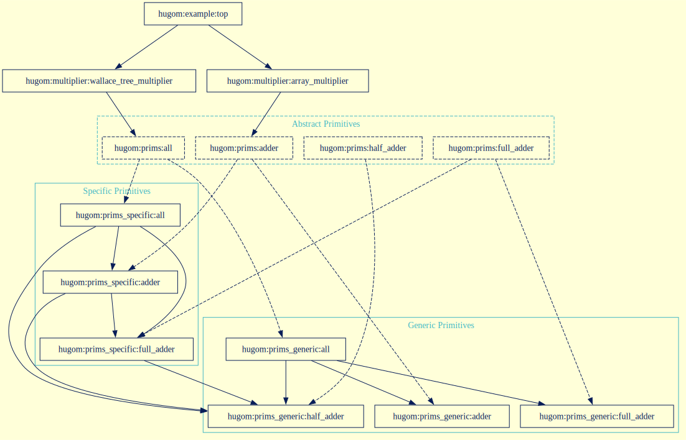
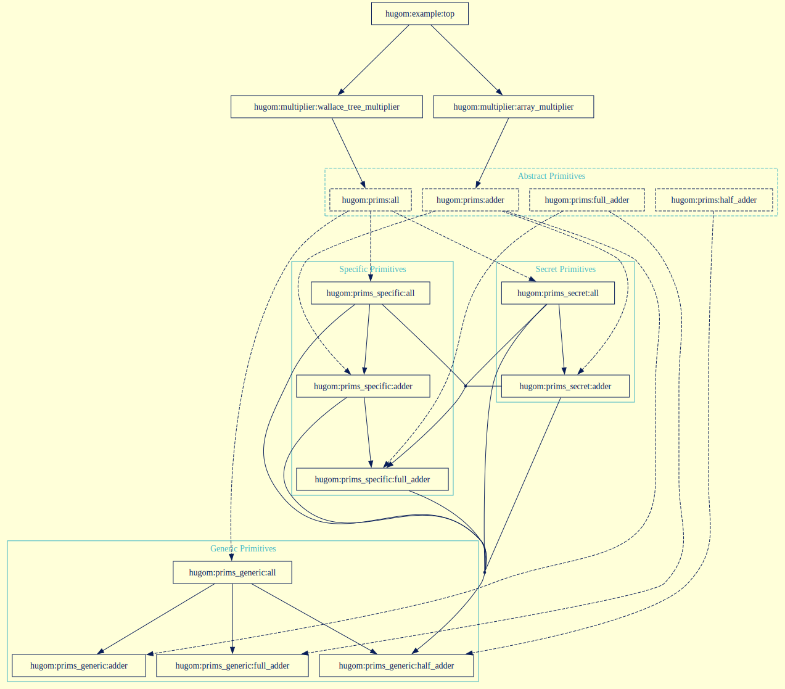

# FuseSoC primitive libraries examples

A demonstration project highlighting approaches to handling primitive libraries in FuseSoC-based projects.

## What are primitive libraries

Primitive (prim) libraries are common amongst HDL projects with multiple targets, i.e. a simulator, synthesis for an FPGA or synthesis for an ASIC process node.
Primitives provide the basic blocks/modules to digital design engineers,
and importantly enable these basic blocks to be changed depending on the target.
This enable primitive modules to be tailored to their target.

Normally, there are generic primitives that are written in native HDL and made compatible with logic simulators, and there are target-specific primitives that typically instantiate low-level primitives of the target ecosystem, such as ASIC standard library cells or FPGA programmable/hardened cells.

When a digital designer wants to declare they depend on a particular set of primitives, there needs to be a notion of an abstract primitive which the designer can depend on, and which can be swapped for a concrete implementation by the build system when the target is known.

An additional constraint in open source silicon projects is that these primitive libraries need to be easy to add by people using the project without any information about them being required in the upstream open source repository.
A motivating example is ASIC standard libraries.
The use of a particular ASIC standard library or any information about it is often sensitive, and cannot appear in the upstream repository.


## The toy example

The diagram below shows the dependency tree of the toy example.



The top level (`hugom:example:top`) depends on two multiplier IP blocks: `hugom:multiplier:array_multiplier` and `hugom:multiplier:wallace_tree_multiplier`.
The array multiplier only requires the adder primitive, so depends only on `hugom:prims:adder`.

The dotted line around `hugom:prims:adder`, and all other cores in it's `hugom:prims` library,
denote these are abstract cores without any real implementation.
They then depend on their possible implementations, which either come from either the `hugom:prims_generic` or `hugom:prims_specific` libraries.

`hugom:multiplier:wallace_tree_multiplier` not only depends on an adder module but also half and full adder modules.
Instead of having to specifying all the dependencies, it can depend on `hugom:prims:all` to declare that it depends on all modules provided by the primitives library.

A useful feature is for a primitives library to be able to implement only a subset of the primitives required by a primitives library, and then be able to specify an implementation to fall back on for the primitives that it doesn't implement.
In the toy example, `hugom:prims_specific` doesn't implement a half adder and instead makes use of the `hugom:prims_generic:half_adder`.


### The complete toy example

Now that we have a grasp of the dependency tree, let's add a third implementation of the primitives: `prims_secret`.
This secret primitives library only implements an adder. For it's full and half adder it relies on `prims_specific` and `prims_generic` respectively.
The full dependency tree can be seen below.




## How to set up primitive libraries in FuseSoC

Back in 2021, FuseSoC 1.12.0 had no way to handle primitive libraries, which is a reason behind the lowRISC fork of FuseSoC.
**A brief explanation of what this fork added and how it was used by OpenTitan to enable primitive libraries can be read [here](doc/how-opentitan-handles-primitives.md).**

As of FuseSoC versions 2.4, there are two ways to enable the use of primitive libraries: *virtual cores* or *filters*.
Examples of each approach can be found in the [`virtual_cores`](./virtual_cores) and [`filters`](./filters) directories.

The same commands, written below, can be used from either directory to run the directories' example.
*If you haven't already, [set up your development environment](../README.md#developer-environment).*

```sh
fusesoc run hugom:example:top
fusesoc run --flag not_prims_generic --flag prims_specific hugom:example:top
fusesoc run --flag not_prims_generic --flag prims_secret hugom:example:top
```


### The virtual cores approach

Virtual cores are similar to virtual methods in C++ and System Verilog.
A virtual core doesn't have an implementation or core file of it's own, instead other core files can declare they provide the functionality of a virtual core.

In the primitive library example, our abstract primitives library `hugom:prims` consists of virtual cores.
These virtual cores can be depended upon by the multipliers.
For example, the array multiplier depends on the abstract `hugom:prims:adder`.

An excerpt from [`virtual_cores/multipliers/array_multiplier.core`](virtual_cores/multipliers/array_multiplier.core):

```yaml
name: hugom:multiplier:array_multiplier
filesets:
  files_rtl:
    depend:
      - hugom:prims:adder
```

There are three available implementations of the adder: `hugom:prims_generic:adder`, `hugom:prims_specific:adder` and `hugom:prims_secret:adder`.
In each of their core files, you'll notice they declare that they provide `hugom:prims:adder`.

An excerpt of [`virtual_cores/prims_specific/adder.core`](virtual_cores/prims_specific/adder.core):

```yaml
name: hugom:prims_specific:adder
virtual:
  - hugom:prims:adder
```

So how do you select an implementation to use?
You add it as a dependency to a core file.
Importantly, this can be the top core file which allows you to specify the particular implementation you'd like once at the top of the dependency tree.
All the dependencies on virtual cores are then replaced with a concrete implementation.

We go one step further here and allow one to select an implementation without having to edit the [`top.core`](virtual_cores/top.core) file, by making use use of FuseSoC's flags feature.
This enables one to set flags in the command line to select a primitive.
For example, one can set the flags `not_prims_generic` and `prims_specifc` to select the `prims_specific` implementations.

An excerpt of [`virtual_cores/top.core`](virtual_cores/top.core):

```yaml
name: hugom:example:top
filesets:
  files_top:
    depend:
      - "hugom:multiplier:array_multiplier"
      - "hugom:multiplier:wallace_tree_multiplier"
      - "!not_prims_generic ? (hugom:prims_generic:all)"
      - "prims_specific ? (hugom:prims_specific:all)"
      - "prims_secret ? (hugom:prims_secret:all)"
```

Notice, depending on whether the flag is set (or not set in the `prims_generic` case) the primitives block is included as a dependency.

If you run the following command from the `virtual_cores` directory, you should see:

```console
$ fusesoc run --flag not_prims_generic --flag prims_secret hugom:example:top
INFO: Preparing hugom:prims_generic:half_adder:0
INFO: Preparing hugom:prims_specific:full_adder:0
INFO: Preparing hugom:prims_secret:adder:0
INFO: Preparing hugom:multiplier:array_multiplier:0
INFO: Preparing hugom:prims_secret:all:0
INFO: Preparing hugom:multiplier:wallace_tree_multiplier:0
INFO: Preparing hugom:example:top:0
INFO: Setting up project
INFO: Building simulation model
INFO: Running
INFO: Running simulation
- src/hugom_example_top_0/top.sv:80: Verilog $finish
- S i m u l a t i o n   R e p o r t: Verilator 5.028 2024-08-21
- Verilator: $finish at 400ns; walltime 0.001 s; speed 197.039 us/s
- Verilator: cpu 0.002 s on 1 threads; alloced 253 MB
```

Looking at the 'Preparing' messages, we can see `all` and `adder` are taken from the `prims_secret` library which was selected by the `--flag prims_secret` argument.
Because `prims_secret` doesn't implement `full_adder` or `half_adder`, instead relying on `prims_specific` and `prims_generic` respectively for them.
These primitives are taken from these libraries.

Do revisit [the complete toy example](#the-complete-toy-example) section to refresh your memory on the dependency graph.


### The filter based approach

You can implement the same behaviour with FuseSoC's filters.
All of the System Verilog files and most of the core files in the [`filters`](./filters) example are exactly the same.

The main difference is that instead of declaring each primitive as a virtual core provider.
We create empty core files in [`prims`](./filters/prims) to act as abstract cores.

Then in [the top core file](./filters/top.core) we declare a filter:

```yaml
targets:
  default:
    filters: [prims_harden]
```

This instructs FuseSoC to run the [`prims_harden.py`](../python_plugins/fusesoc/filters/prims_harden.py) filter.
This filter runs through the dependency tree checking only one implementation of each primitive exists.
Then replaces these empty abstract primitive cores with the selected implementation of each primitive.

If you run the following command from the `filters` directory, you should see:

```console
$ fusesoc run --flag not_prims_generic --flag prims_secret hugom:example:top
INFO: Preparing hugom:prims:adder:0
INFO: Preparing hugom:prims:all:0
INFO: Preparing hugom:prims_generic:half_adder:0
INFO: Preparing hugom:multiplier:array_multiplier:0
INFO: Preparing hugom:multiplier:wallace_tree_multiplier:0
INFO: Preparing hugom:prims_specific:full_adder:0
INFO: Preparing hugom:prims_secret:adder:0
INFO: Preparing hugom:prims_secret:all:0
INFO: Preparing hugom:example:top:0
INFO: Applying filter prims_harden
INFO: Replacing hugom:prims:adder:0 with hugom:prims_secret:adder:0.
INFO: Replacing hugom:prims:all:0 with hugom:prims_secret:all:0.
INFO: Setting up project
INFO: Building simulation model
INFO: Running
INFO: Running simulation
- src/hugom_example_top_0/top.sv:80: Verilog $finish
- S i m u l a t i o n   R e p o r t: Verilator 5.028 2024-08-21
- Verilator: $finish at 400ns; walltime 0.001 s; speed 213.311 us/s
- Verilator: cpu 0.002 s on 1 threads; alloced 253 MB
```

The 'Replacing' messages come from the prims_harden filter, to inform us of when it's replacing an empty abstract primitive with a concrete implementation.

*I've also created an alternative [`prims_prune_priority.py`](../python_plugins/fusesoc/filters/prims_prune_priority.py) filter which you can look at if curious.*

## Some further thoughts

Currently in the examples, modules within a primitives library depend on specific implementations of other modules in the primitives library.
This could lead to multiple versions of the same primitive being bought in and breaking builds.
A simple solution would be to have primitive modules only depend on abstract primitives.
With the one exceptions of the `prims:all` implementation which specifies the concrete implementations for each primitive in the library.
This will improve the ease of implementation re-use when adding new primitives.

Another note, FuseSoC currently correctly complains when multiple implementations of a **virtual core** exist.
However, if no implementation is given it will silently select an implementation for you.
This behaviour could cause confusion.
A better behaviour would be to complain about no implementation being specified.
To see this in action run the following from the `virtual_cores` directory.

```sh
# Complains when two implementations are specified
fusesoc run --flag prims_specific hugom:example:top
# Doesn't complain when no implementation specified
# instead silently picks one for you.
fusesoc run --flag not_prims_generic hugom:example:top
```
