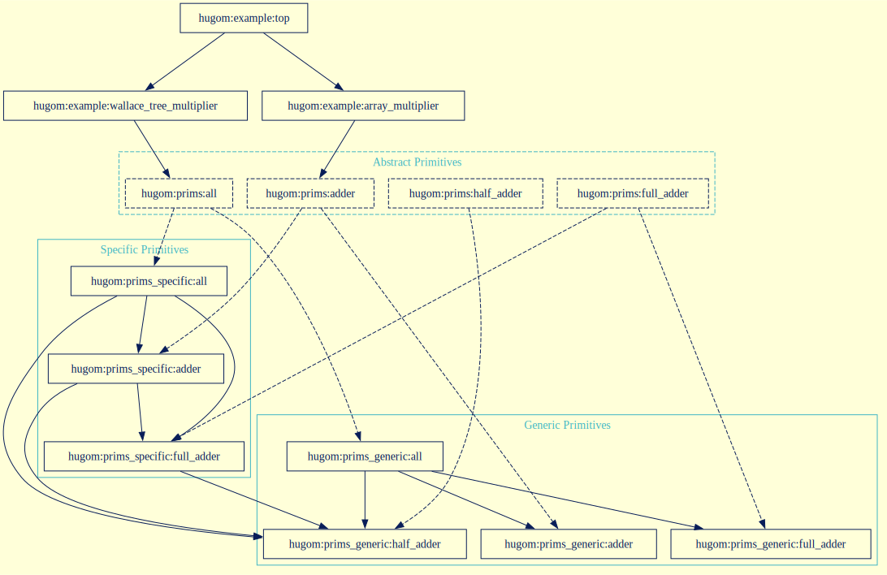

# FuseSoC Primitive Libraries Examples

A demonstration project highlighting two approaches to handling primitive libraries in FuseSoC-based HDL build systems.

## Overview

Primitive (prim) libraries are common amongst HDL projects targetting real hardware.
Usually, a project includes generic/transparent implementations, mirrored by target-specific/opaque implementations.
The generic implementations are typically written in native HDL and made compatible with logic simulators.
The target-specific implementations typically instantiate low-level primitives of the target ecosystem, such as ASIC standard library cells or FPGA programmable/hardened cells, for use in synthesis.
Building/swapping prim libraries is an important task for a build system used for simulation and/or synthesis.

There are two possible approaches for prim library support in FuseSoC: **virtual cores** or **filters**.

## The Toy Example




## Commands

If you want an easy way to pull in all the required dependencies, have a look at the [Developer Environment](#developer-environment) section.

Run the virtual cores example:

```sh
# In a `nix develop` shell...
pushd examples/virtual_cores
fusesoc run hugom:example:top
# Or to use specific prims
fusesoc run --flag select_prims --flag prims_specific hugom:example:top
```


## Developer Environment

The Nix shell provides all.

Install Nix using the instructions at: <https://zero-to-nix.com/start/install>

Start a project-specific development shell in the project directory using:

```sh
# In fusesoc-prim-lib-examples directory...
nix develop .
```
