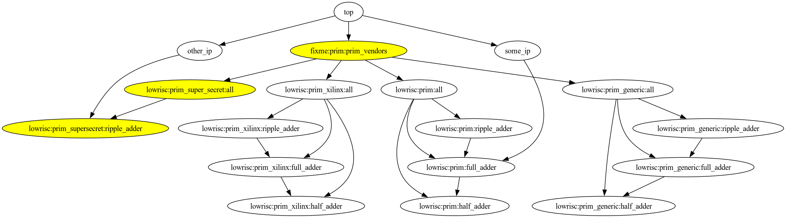

* *:*:all are meta cores. I.e. they only depend on other cores and don't have any code associated with them.

* lowrisc:prim:* are abstract cores. They only exist as placeholders at this time.

top depends on two IP cores. One of them depends on a full_adder of any kind and the other depends specifically on a ripple_adder from the supersecret vendor library.

top also depends on the meta core prim_vendors. prim_vendors in turn depend on all the tech-specific (+generic) meta cores. OpenTitan will carry a public prim_vendors that depends on prim_generic:all, prim_xilinx:all, prim_xilinx_ultrascale:all etc. A vendor that wants to additionally add in support for a private set of tech-specific primitives (called supersecret in this example) will have to:

* Create core description files for the individual primitives
* Create a supersecret:all meta core that carries all the dependencies on the individual primitives
* **Override** the opentitan-provided prim_vendors core using FuseSoC's override mechanism.

This is the full dependency tree that will be created.

The above tree brings in a lot more dependencies than what is actually needed, so the next step is to use a filter to trim down the dependencies. We will also create concrete implementations of the abstract cores at this point.

First we identify which abstract prims that have been requested (full_adder from some_ip in this case). We then go through the tree and find tech-specific primitives with matching names (prim_xilinx:full_adder and prim_generic:full_adder but nothing in prim_supersecret). For these we create the wrapper as the current version of primgen does.

Next we remove all the meta cores, lowrisc:prim_*:all. This will lead to a lot of cores are orphaned, and we can go through the tree to remove those. Finally we end up with the following tree.

